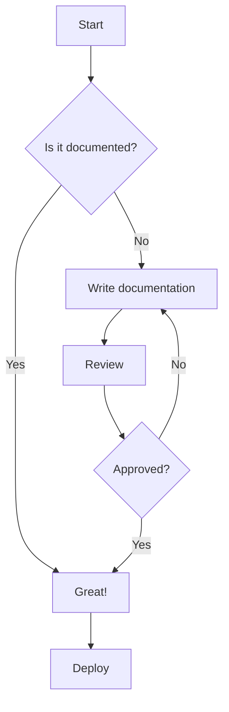
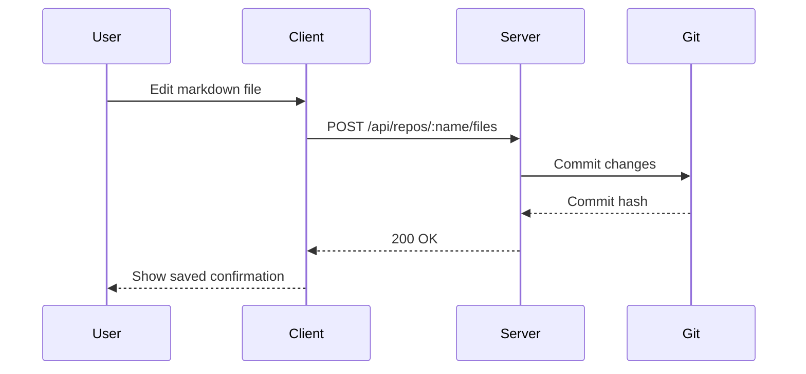
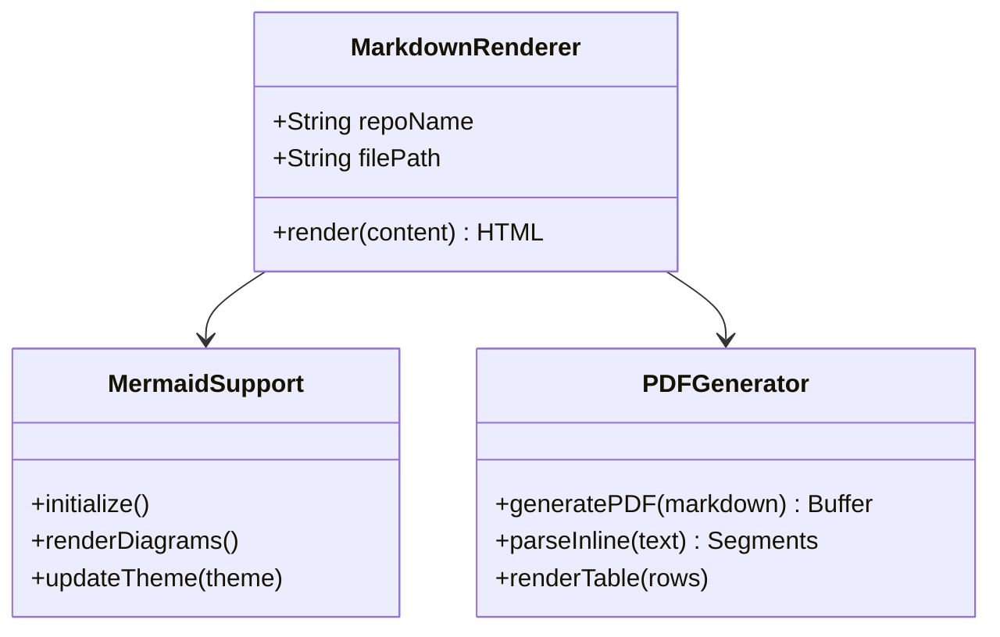
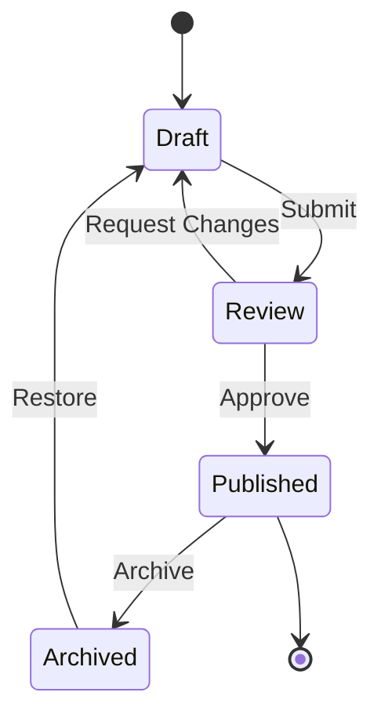
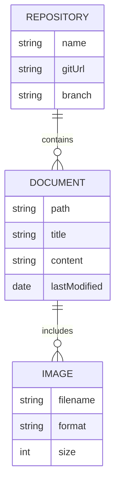
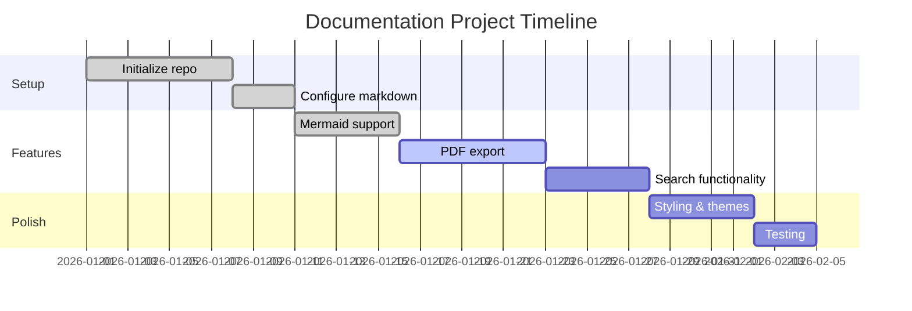
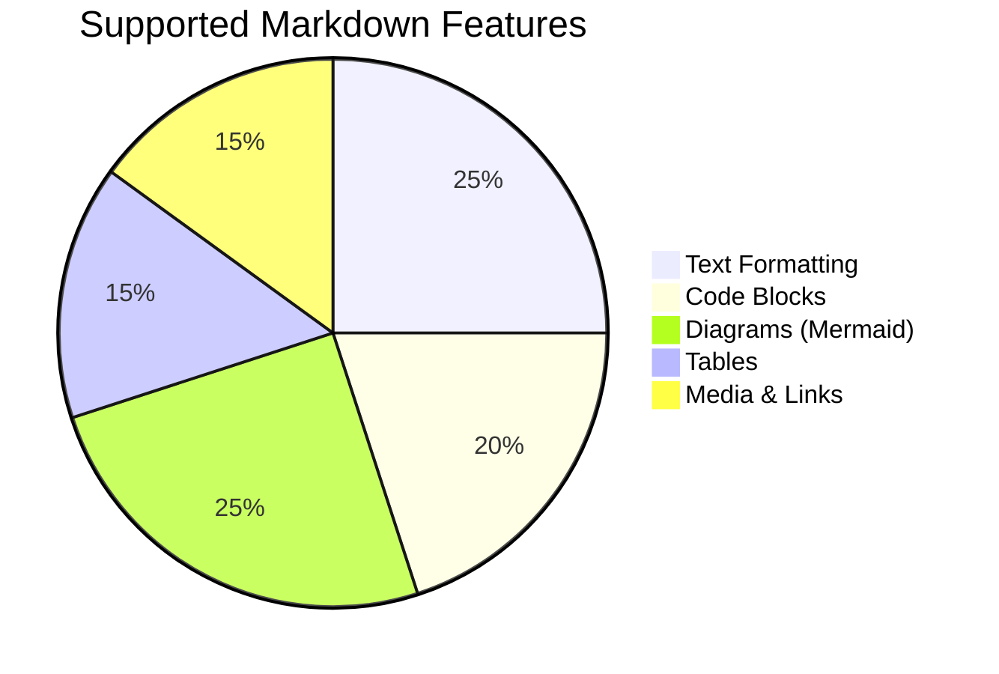
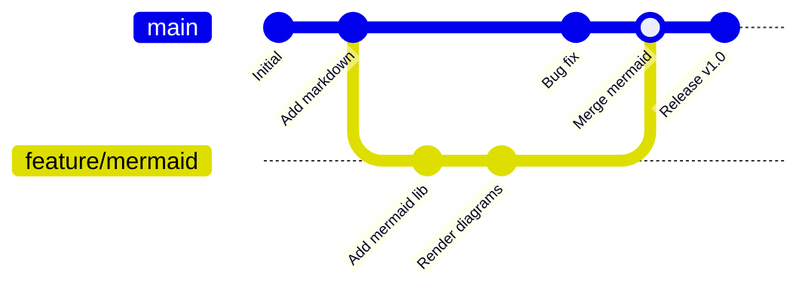

# Markdown Capabilities Demo

This document showcases every Markdown feature supported by the documentation tool, powered by **markdown-it** with `html: true`, `linkify: true`, and `breaks: true`.

---

## Headings

# Heading 1
## Heading 2
### Heading 3
#### Heading 4
##### Heading 5
###### Heading 6

Each heading automatically gets a clickable anchor link (via `markdown-it-anchor`) that appears on hover.

---

## Inline Formatting

This is **bold text** and this is __also bold__.

This is *italic text* and this is _also italic_.

This is ***bold and italic*** combined.

This is ~~strikethrough~~ text.

This is `inline code` with a highlighted background.

---

## Links

### Internal Links

Link to another markdown file: [Title Information](work-description/title-information.md)

Link to a section in another file: [Specific Section](work-description/title-information.md#section-name)

Link to a section on this page: [Jump to Tables](#tables)

### External Links

External links open in a new tab automatically: [Anthropic](https://www.anthropic.com)

### Auto-linked URLs

URLs are automatically converted to links: https://www.example.com

---

## Images

Images with alt text are rendered inside a `<figure>` with a `<figcaption>`:


Images with generic alt text render without a caption:


---

## Lists

### Unordered List

- First item
- Second item
  - Nested item A
  - Nested item B
    - Deeply nested item
- Third item

### Ordered List

1. First step
2. Second step
   1. Sub-step A
   2. Sub-step B
3. Third step

### Mixed Lists

1. Ordered item
   - Unordered sub-item
   - Another sub-item
2. Another ordered item

### Task Lists

- [x] Completed task
- [ ] Incomplete task
- [x] Another completed task

---

## Blockquotes

> This is a blockquote. It has a colored left border and background.

> Blockquotes can span multiple lines.
>
> They can contain **bold**, *italic*, and `code`.
>
> > And they can be nested.

---

## Tables

| Feature | Status | Notes |
|---------|--------|-------|
| Headings | Supported | H1 through H6 |
| Bold | Supported | `**text**` or `__text__` |
| Italic | Supported | `*text*` or `_text_` |
| Strikethrough | Supported | `~~text~~` |
| Tables | Supported | With alternating row stripes |

### Table with Alignment

| Left Aligned | Center Aligned | Right Aligned |
|:-------------|:--------------:|--------------:|
| Left | Center | Right |
| Data | Data | Data |
| More data | More data | More data |

### Table with Inline Formatting

| Name | Description | Example |
|------|-------------|---------|
| **Bold** | Strong emphasis | `**text**` |
| *Italic* | Light emphasis | `*text*` |
| `Code` | Inline code | `` `code` `` |
| [Link](https://example.com) | Hyperlink | `[text](url)` |

---

## Code Blocks

### Generic Code Block

```
This is a plain code block
with no syntax highlighting.
```

### JavaScript

```javascript
function greet(name) {
  const message = `Hello, ${name}!`;
  console.log(message);
  return message;
}

// Arrow function with array methods
const numbers = [1, 2, 3, 4, 5];
const doubled = numbers.map(n => n * 2);
```

### Python

```python
class DocumentParser:
    def __init__(self, path):
        self.path = path
        self.content = None

    def parse(self):
        with open(self.path, 'r') as f:
            self.content = f.read()
        return self.content

    @property
    def word_count(self):
        return len(self.content.split()) if self.content else 0
```

### HTML

```html
<!DOCTYPE html>
<html lang="en">
<head>
  <meta charset="UTF-8">
  <title>Document</title>
</head>
<body>
  <h1>Hello World</h1>
  <p>This is a paragraph.</p>
</body>
</html>
```

### CSS

```css
.markdown-body {
  font-family: -apple-system, BlinkMacSystemFont, 'Segoe UI', sans-serif;
  line-height: 1.7;
  color: var(--text-primary);
}

.markdown-body h1 {
  font-size: 2em;
  border-bottom: 1px solid var(--border-color);
}
```

### JSON

```json
{
  "name": "documentation-tool",
  "version": "1.0.0",
  "features": ["markdown", "mermaid", "pdf-export"],
  "config": {
    "html": true,
    "linkify": true,
    "breaks": true
  }
}
```

### Shell / Bash

```bash
#!/bin/bash
echo "Installing dependencies..."
npm install
npm run build
echo "Done!"
```

---

## Mermaid Diagrams

Mermaid blocks are rendered as interactive SVG diagrams with automatic dark/light theme support.

### Flowchart



### Sequence Diagram



### Class Diagram



### State Diagram



### Entity Relationship Diagram



### Gantt Chart



### Pie Chart



### Git Graph



---

## Horizontal Rules

Three different syntaxes all produce a horizontal rule:

---

***

___

---

## Line Breaks

The `breaks: true` option means a single newline
creates a line break without needing two trailing spaces.

This is on a new line.
And so is this.

---

## HTML Support

Since `html: true` is enabled, raw HTML is rendered directly:

<details>
<summary>Click to expand</summary>

This content is hidden by default. It can contain **markdown** formatting.

- Item one
- Item two

</details>

<div style="padding: 12px; background: #f0f7ff; border-left: 4px solid #4a90d9; border-radius: 4px; margin: 1em 0;">
  <strong>Note:</strong> You can use HTML for custom callouts and styling.
</div>

<kbd>Ctrl</kbd> + <kbd>S</kbd> to save.

Text with <mark>highlighted content</mark> using HTML.

<sup>Superscript</sup> and <sub>subscript</sub> text.

---

## Escaping

Use backslashes to display literal markdown characters:

\*This is not italic\*

\# This is not a heading

\[This is not a link\](url)

\`This is not code\`

---

## Combined / Complex Examples

### Blockquote with Multiple Elements

> ### Documentation Best Practices
>
> 1. Write **clear** and *concise* documentation
> 2. Include `code examples` where appropriate
> 3. Use [links](https://example.com) to reference sources
>
> | Do | Don't |
> |----|-------|
> | Use headings | Write walls of text |
> | Add examples | Assume knowledge |

### Nested Content

1. **First major section**

   Paragraph inside a list item with `inline code`.

   ```javascript
   const example = "code block inside a list";
   ```

2. **Second major section**

   > A blockquote inside a list item.

   - Nested unordered list
   - With multiple items

---

*This demo was generated to showcase all markdown rendering capabilities of the documentation tool.*
